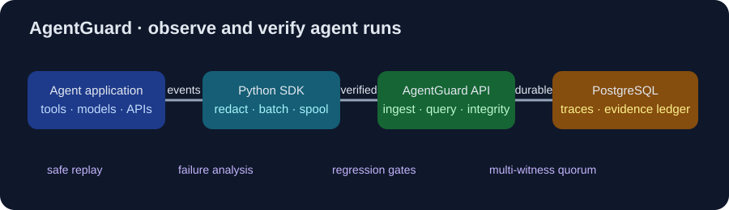

# AgentGuard

AgentGuard is an AI-agent flight recorder and reliability/debugging platform.
It records trace and span events, preserves verifiable evidence, and helps
teams understand failures and regressions. It is an observability and evidence
layer around an agent application, not another agent.

**Observe. Replay safely. Diagnose failures. Detect regressions. Preserve
verifiable evidence.**

Start with the [examples](examples/README.md) or the short Quick Start below.

AI agents combine LLMs, tools, APIs, browsers, and databases. When a run
fails, teams need to know what happened, which call caused it, what evidence
was recorded, whether the failure can be safely replayed, and whether a new
version regressed. AgentGuard provides the observability, debugging, and
evidence workflow around those questions.

## What it provides

- A Python tracing SDK with bounded buffering, batching, redaction, and
  fail-open behavior when the recorder is unavailable.
- A FastAPI service for authenticated multi-tenant ingest and trace retrieval.
- PostgreSQL-backed trace storage and database migrations.
- Dashboard, incident management, notifications, failure analysis, and
  regression evaluation.
- OpenTelemetry and OTLP ingestion, durable delivery, OIDC/RBAC, and
  high-availability coordination.
- Cryptographic evidence chains, safe replay guardrails, cold archive,
  integrity metadata archival, external witness anchoring, and
  multi-replica archive verification and recovery.
- Multi-witness quorum continuity controls and an optional OpenAI example.

## Architecture

    Agent application -> Python SDK -> batched ingest -> AgentGuard API
                                                   -> PostgreSQL
                                                   -> dashboard
                                                   -> optional archives and witnesses

The normal local topology is intentionally small: PostgreSQL, a migration
job, and the API server. Optional retention, ledger, integrity, and
replication workers are Compose profiles. The V20 acceptance topology is
separate and is not the local development default.

## Scope and limitations

AgentGuard is an observability, debugging, and evidence layer around an agent
application; it is not the agent, an authorization boundary for the application,
or a replacement for deployment security controls. The local Quick Start is a
development topology with loopback HTTP, one PostgreSQL instance, and optional
features disabled. Production operators must provide their own TLS, secret
management, access controls, monitoring, backups, and operational risk review.
AgentGuard makes no absolute security or compliance guarantee and is not
designed to prevent prompt injection or other attacks.

## Quick Start

### Prerequisites

- Git
- Docker Desktop or Docker Engine with Compose v2
- Python 3.12 or newer
- Ports 8000 and 5432 available on loopback

### Start the local stack

From PowerShell:

    git clone https://github.com/karry4006/agentguard.git
    cd agentguard
    powershell -ExecutionPolicy Bypass -File .\scripts\bootstrap-dev.ps1
    docker compose up --build -d
    curl.exe http://127.0.0.1:8000/health

The bootstrap creates cryptographically random local credentials and ignored
secret files. It refuses to overwrite an existing .env or .dev-secrets
directory. Keep the generated values local.

Create a demo tenant and an ingest key:

    docker compose exec -T agentguard-server /usr/bin/python3.13 -m agentguard_server.cli tenant create --slug demo --name "Local Demo"
    docker compose exec -T agentguard-server /usr/bin/python3.13 -m agentguard_server.cli key create --tenant demo --name basic-demo --scopes ingest:write,traces:read,dashboard:access,incidents:read,integrity:read

The key command prints a one-time API key. Store it in your shell environment,
then run the no-paid-API example:

    $env:AGENTGUARD_INGEST_URL = "http://127.0.0.1:8000/v1/ingest"
    $env:AGENTGUARD_API_KEY = "<one-time-key>"
    python -m pip install -e .\sdk\python
    python .\examples\basic_agent\run.py

Retrieve the trace through the API and open the dashboard:

    curl.exe -H "Authorization: Bearer <one-time-key>" http://127.0.0.1:8000/v1/traces
    Start-Process http://127.0.0.1:8000/ui/login

Stop the stack without deleting its database volume:

    docker compose stop

The local demo disables content capture and external anchoring. It uses
loopback HTTP, one PostgreSQL instance, local credentials, and no external
witness, archive, replica, OIDC, or TLS deployment. This is a development
topology, not a production configuration.

For the full workflow, troubleshooting, and Linux/macOS equivalents, see
[docs/quickstart.md](docs/quickstart.md). The local API reference is available
at `http://127.0.0.1:8000/docs` and `/openapi.json` while the stack is running.

## Repository layout

- server: FastAPI service, migrations, and server-side domain logic
- sdk/python: Python tracing SDK
- examples: deterministic demos plus optional OpenTelemetry and OpenAI examples
- postgres: local database initialization
- docs: architecture, security, operations, replay, and release guidance
- scripts: development bootstrap, checks, CI, and security scanning
- tests: unit, integration, and historical acceptance coverage
- artifacts: local and internal release evidence; review before publication

## Development and security

Start with [CONTRIBUTING.md](CONTRIBUTING.md). Read
[docs/security.md](docs/security.md) and [SECURITY.md](SECURITY.md) before
working on authentication, evidence integrity, replay, archives, or
retention. This repository is licensed under
[Apache-2.0](LICENSE). The configured target for vulnerability reports is
`agentguard.project@gmail.com`; do not file security vulnerabilities as public
GitHub issues. Include reproduction information where appropriate and do not
send secrets unnecessarily. No response SLA or vulnerability bounty is
promised.

AgentGuard V20 core remains sealed and complete. AgentGuard V21 has not
started.
